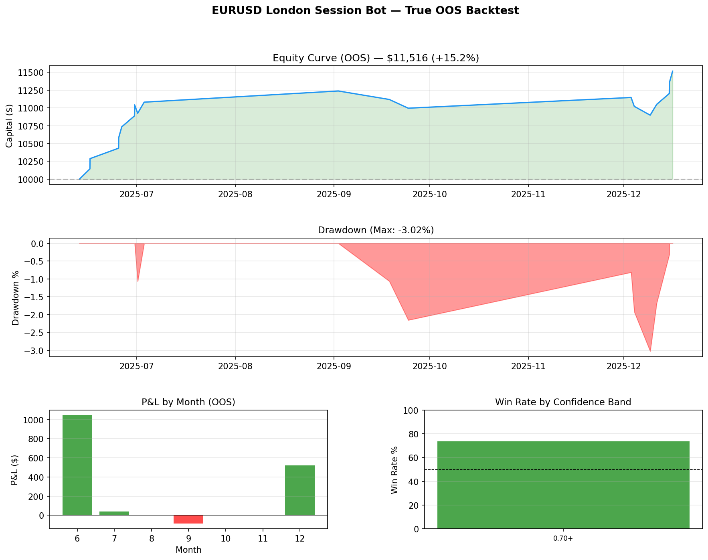

# EURUSD London Session Trading Bot

An end-to-end algorithmic trading system that uses machine learning to trade 
the EURUSD forex pair during the London session open. Built with Python, 
LightGBM, and MetaTrader 5.



## Results (True Out-of-Sample: Jun–Dec 2025)

| Metric | Value |
|--------|-------|
| Return | +14.74% |
| Win Rate | 76.5% |
| Profit Factor | 4.01 |
| Sharpe Ratio | 10.28 |
| Max Drawdown | -3.03% |
| Total Trades | 17 |
| Period | 6 months |

> **Note:** Tested on data completely unseen during training.  
> Past performance does not guarantee future results.

## Architecture

Raw Data (OHLCV + Tick)
↓
Multi-Timeframe Feature Engineering (M5 / H1 / H4)
↓
Overnight Context + Microstructure Features
↓
LightGBM Classifier (session direction prediction)
↓
Dynamic Regime Filter (H4 trend alignment)
↓
Live Execution via MetaTrader 5 API

## Data Sources

- **OHLCV:** HistData.com — EURUSD M1 (2022–2026), resampled to M5/H1/H4
- **Tick data:** Dukascopy — EURUSD tick (2023–2025)
  - Real bid/ask spread per tick
  - Tick direction and velocity
  - Buy/sell pressure imbalance

## Features (67 total)

**H1 Indicators:** EMA cross, RSI, ATR regime, MACD, BB position, 
range ratio, structure distance

**H4 Context:** Trend alignment, RSI slope, ATR ratio, MACD signal, 
BB width, ROC

**Tick Microstructure:**
- `tick_imbal_3h` — 3-hour tick direction imbalance
- `spread_3h` — rolling spread context
- `buy_pres_3h` — buying pressure proxy
- `tick_velocity` — ticks per second

**Overnight Context:**
- `overnight_ret` — price return midnight → London open
- `last_hour_ret` — final hour momentum before London
- `overnight_macd` — overnight MACD state
- `overnight_bb_pos` — BB position at London open

**Interaction Features:**
- `trend_x_overnight` — H4 trend × overnight momentum
- `tick_x_trend` — tick imbalance × H4 alignment
- `ovn_rsi_x_macd` — RSI/MACD confluence

## Strategy Logic
Time:       London open (07:00–08:00 UTC), Monday–Thursday
Direction:  Determined by H4 regime (bull → long, bear → short)
Entry:      Market order at London open bar close
TP:         1.5 × H1 ATR
SL:         1.0 × H1 ATR  (1:2 R:R enforced)
Exit:       TP/SL hit or NY close (21:00 UTC)
Filter:     ML confidence > 0.70
Risk:       1% of capital per trade

## Dynamic Regime Detection

No hardcoded calendar filters. Regime is detected in real time from:
- H4 EMA alignment (8/21/50/200)
- H4 RSI slope direction
- H4 MACD histogram sign
- H1 EMA confirmation

This allows the bot to adapt when market conditions change — 
switching from long to short bias automatically.

## Project Structure
├── config.py                          # Central configuration
├── src/
│   ├── data/
│   │   ├── download_ticks.py          # Dukascopy tick downloader
│   │   ├── process_histdata.py        # HistData OHLCV processor
│   │   ├── process_ticks.py           # Tick → M5 microstructure
│   │   └── build_lean_session_dataset.py  # Final dataset builder
│   ├── features/
│   │   └── build_mtf_data.py          # MTF indicator computation
│   ├── models/
│   │   ├── train_lgbm_session.py      # LightGBM training
│   │   └── lstm_model.py              # LSTM architecture (experimental)
│   ├── backtest/
│   │   └── backtest.py                # True OOS backtester
│   └── live/
│       └── live_bot.py                # MT5 live execution
└── backtest_results/
└── oos_backtest.png               # Performance chart

## Setup

```bash
# 1. Clone repo
git clone https://github.com/michael05josh-netizen/eurusd-london-bot.git
cd eurusd-london-bot

# 2. Create virtual environment
python -m venv venv
venv\Scripts\activate  # Windows

# 3. Install dependencies
pip install -r requirements.txt

# 4. Download data (see src/data/ scripts)
python src/data/process_histdata.py
python src/data/download_ticks.py
python src/data/process_ticks.py

# 5. Build dataset
python src/data/build_lean_session_dataset.py

# 6. Train model
python src/models/train_lgbm_session.py

# 7. Backtest
python src/backtest/backtest.py

# 8. Run live (requires MT5)
python src/live/live_bot.py
```

## Key Design Decisions

**Why LightGBM over LSTM?**
With ~900 labeled sessions, LightGBM generalizes better than deep learning. 
LSTM requires 2000+ samples for reliable generalization on financial data. 
The LSTM architecture is included for future use when more data is available.

**Why London session only?**
London open (07:00–09:00 UTC) has the highest liquidity and clearest 
directional moves of any forex session. Price action is more predictable 
and spreads are tightest.

**Why tick microstructure features?**
Standard OHLCV indicators are lagging and widely known — they offer minimal 
edge at M5 timeframes. Tick-derived features (imbalance, velocity, spread 
context) capture real-time order flow that precedes price movement.

## Lessons Learned

- OHLCV indicators alone have near-zero predictive power at M5 on forex
- Tick microstructure + overnight context are the real signal sources
- Sample size matters more than model complexity for financial ML
- True OOS testing (temporal split, no lookahead) gives dramatically 
  different results than in-sample validation
- Dynamic regime detection outperforms calendar-based filters

## Disclaimer

This project is for educational purposes. Trading forex carries significant 
risk. Never trade with money you cannot afford to lose.

## Author

Built by Josh — Computer Engineering student at Ahmadu Bello University, 
specializing in AI/NLP and embedded systems.

*"Building AI systems that work where infrastructure doesn't"*

